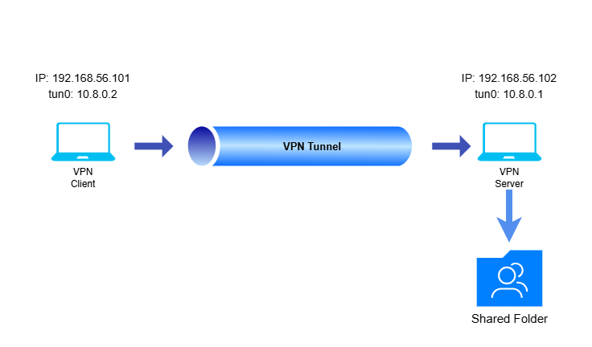

# Secure_Remote_FileServer_Project
This lab setup demostrate how to create a **Secure remote file server** that can be accessd only using a **VPN tunnel**. To setup this lab, use OpenVPN, Samba server and UFW. Also two Ubuntu VM machine use one as **Server** and other one as **Client**.

## Project Overview
This lab simulated a secure network connection by;
- OpenVPN provides encrypted client-server communication.
- Samba hosts a shared directories for user groups.
- UFW firewall restricts SMB access *only* to *VPN clients*.
- The clients can access the shared folders only via VPN tunnel.

## Technologies used

- OpenVPN
- Samba
- UFW firewall
- Ubuntu OS
- Virtual Box

## Lab Topology



## Steps

##### You can automate these configurations by running the scripts I provided.

### 1. Configure Server Machine
#### 1.1 Setup the OpenVPN server
Install required packages
```
sudo apt update
sudo apt install openvpn easy-rsa samba
```

Then we need to create the openVPN directory
```
make-cadir openvpn-ca
```
After that we need to build PKI and Certificate Authority
```
./easyrsa init-pki
./easyrsa build-ca
# Ask for a password, enter and press enter, this password will use after
# ask for common name, give one and enter
```
Creating server certificate and key
```
./easyrsa gen-req server nopass
# give a commmon name and enter
./easyrsa sign-req server server
```
Creating client certificate and key
```
./easyrsa gen-req client1 nopass
# give a commmon name and enter
./easyrsa sign-req client client1
```
Generate diffie-hellman key and HMAC signature
```
./easyrsa gen-dh
```
Then we need to copy created certificates and keys to openvpn directory in /etc. Ensure copy following files to the ```/etc/openvpn/``` directory.
  -  ca.crt
  -  server.crt
  -  server.key
  -  ta.key
  -  dh.dem
You can see where these files are, using ```tree .```; it will show the folder tree.

Then we need to create server configuration file.
```
port 1194
proto udp
dev tun
ca ca.crt
cert server.crt
key server.key
dh dh.pem
auth SHA256
tls-auth ta.key 0
topology subnet
server 10.8.0.0 255.255.255.0
ifconfig-pool-persist ipp.txt
push "redirect-gateway def1 bypass-dhcp"
keepalive 10 120
cipher AES-256-CBC
persist-key
persist-tun
status openvpn-status.log
verb 3
```
Then you can start the openvpn server using **systemctl** for background running.
```
sudo systemctl start openvpn@server
sudo systemctl enable openvpn@server
```
You can see the status using;
```
sudo systemctl status openvpn@server
# It should show active status
```

#### 1.2. Configure the Samba file server
In here i assume there is three departments such as IT, HR and Finance. So creat them.
```
sudo mkdir /srv/samba/IT_dep
sudo mkdir /srv/samba/HR_dep
sudo mkdir /srv/samba/Finance_dep
```
You may need `-p` flag if parent folder are doesn't exist.

Then we need to create user groups for each departments and add users for that groups.
```
# creating user groups
sudo groupadd IT_grp
sudo groupadd HR_grp
sudo groupadd Finance_grp
```
```
# add users for groups
sudo useradd -m Kamal -G IT_grp
sudo useradd -m Nimal -G HR_grp
sudo useradd -m Sunil -G Finance_grp
```
Then we need to create smb password for each users.
```
sudo smbpasswd -a Kamal
# enter the passsword
sudo smbpasswd -a Nimal
sudo smbpasswd -a Sunil
```
Then we need to apply permissions
```
sudo chown -R :IT_grp /srv/samba/IT_dep
sudo chmod -R 770 /srv/samba/IT_dep
```
After that we need to update the smb.conf file by adding the shared folders to it.
```
# open the smb.conf file with root permissions and type followings
[IT]
   path = /srv/samba/IT_dep
   read only = no
   valid users = @IT_grp

[HR]
   path = /srv/samba/HR_dep
   read only = no
   valid users = @HR_grp

[Finance]
   path = /srv/samba/Finance_dep
   read only = no
   valid users = @Finance_grp
```
Then we can run the smb server using systemctl.
```
sudo systemctl start smbd
```
and to chech status use `sudo systemctl status smbd`.

Next, we need to set firewall rules to ensure that only the client which are connecting vpn can access the samba server.
```
# allow only openVpn externally
sudo ufw allow  1194/udp
sudo ufw allow 22/tcp
sudo ufw reload
sudo ufw enable
```

In here i use blocking the other interfaces expect the VPN tunnel interface `tun0`
```
# allow only tun0
sudo ufw allow in on tun0 to any port 445
sudo ufw allow in on tun0 to any port 139
# deny others
sudo ufw deny in to any port 445
sudo ufw deny in to any port 139
sudo ufw reload
sudo ufw enable
```

### 2. Configure Client Machine

Install required packages.

And then we need to create the client configuration file.
```
client
dev tun
proto udp
remote <--------> 1194 # we need to enter the server machine ip addrees in here
resolve-retry infinite
nobind
presist-key
presist-tun
remote-cert-tls server
auth SHA256
cipher AES-256-CBC
verb 3
<ca>
# enter ca.crt file content here
</ca>
<cert>
# enter client.crt here
</cert>
<key>
# client.key
</key>
<tls-auth>
# ta.key
</tls-auth>
key-direction 1
```
We can just copy past the contents direct to the client machine or can use `scp` to transfer file from server.


Then we can start the client.conf file using `sudo openvpn --config client.ovpn` command.

### 3. Connecting to Samba server.

We need to ensure the `tun0` interface is up.

Then we can use following commands;
  - `smbclient -L //<----server-tun0-ip---> -N` to list the available files.
  - Using correct user names and password we can access file suing `smbclient //<----server-tun0-ip--->/<file> -U <username>` (as example `smbclient //10.8.0.1/Finance -U Sunil`)
  - We can use command like ls to list down files, put and get to file download and upload.
  - Also we can mount the shared folder using `sudo mount -t cifs //<----server-tun0-ip--->/<file> <mounting_directory> -o username=<username>,password=<password>`

## Features

- Encrypted access to shared folder via OpenVPN
- Samba share with configurable permissions
- Realistic secure remote-access environment

## Summary

This is small lab which demostrate how implement secure remote file share using oprnVPN and smb server with UFW.
